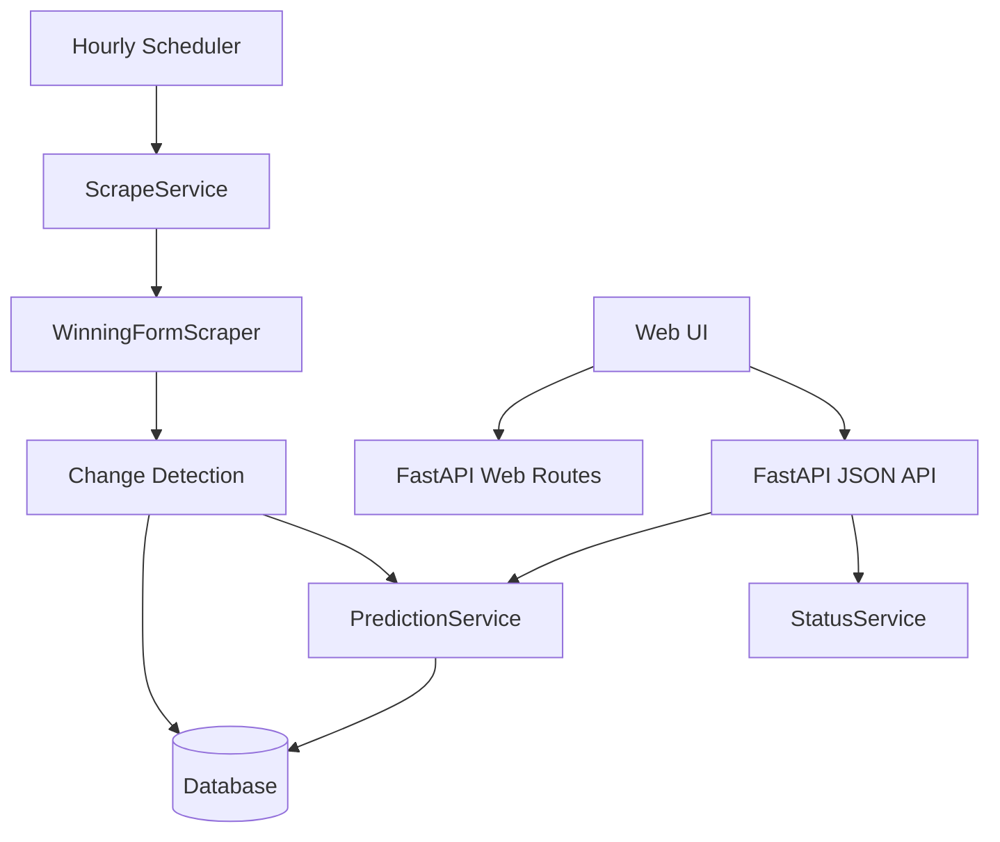

# Architecture

## Layers

- **Presentation**: FastAPI routers, Jinja2 templates, Bootstrap UI, AJAX.
- **Application**: Services coordinate scraping, monitoring, race retrieval, status, and predictions.
- **Domain**: SQLAlchemy entities and scorer modules.
- **Infrastructure**: Async DB session management, httpx scraper client, APScheduler, logging.

## Flow

## Clean architecture decisions

- Routers contain no business rules.
- Repositories isolate persistence queries.
- Services coordinate workflows.
- Scoring logic is modular and swappable.
